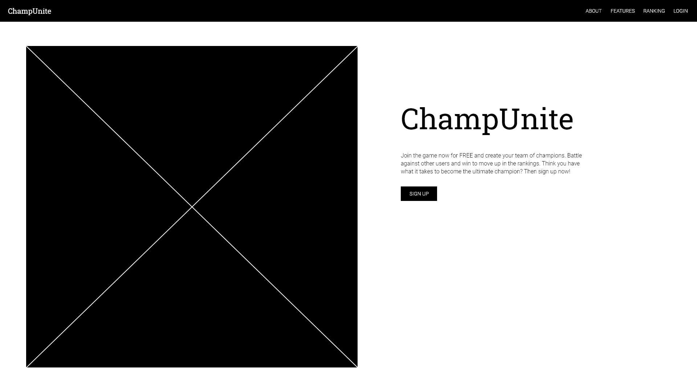
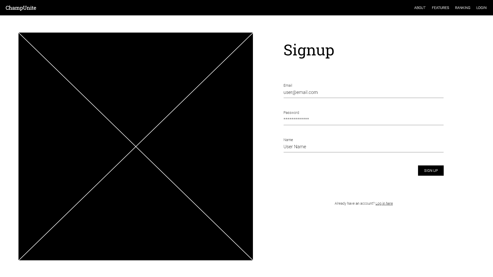
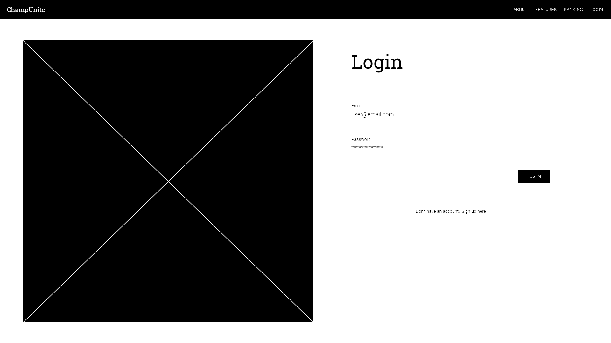
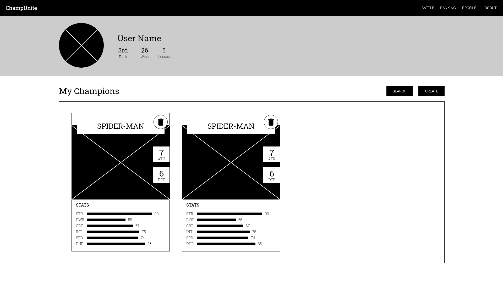
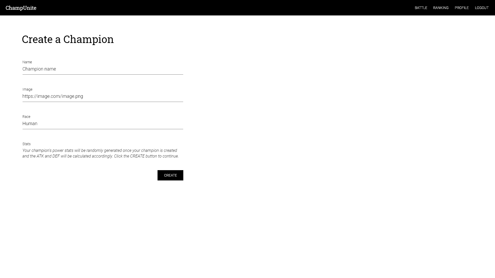
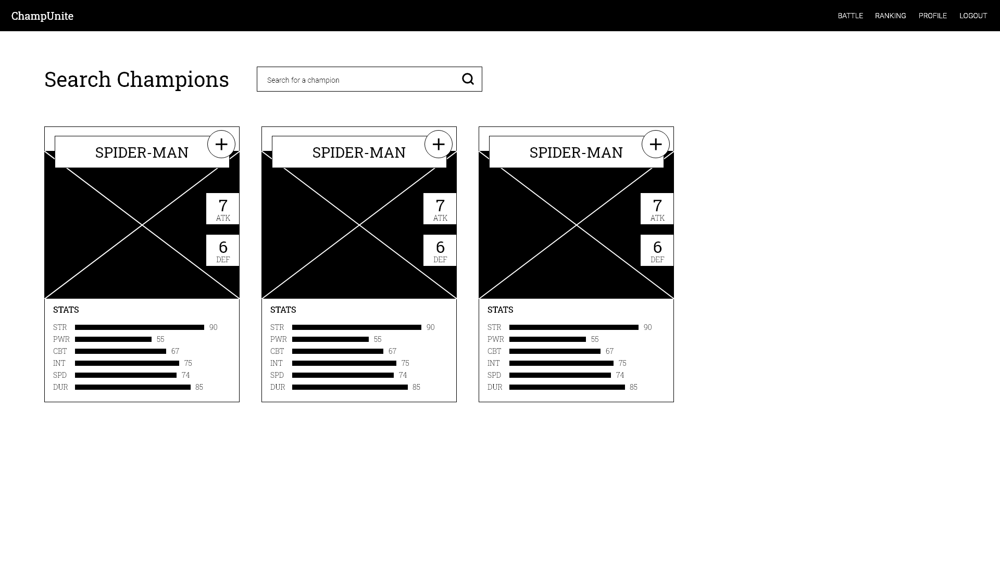
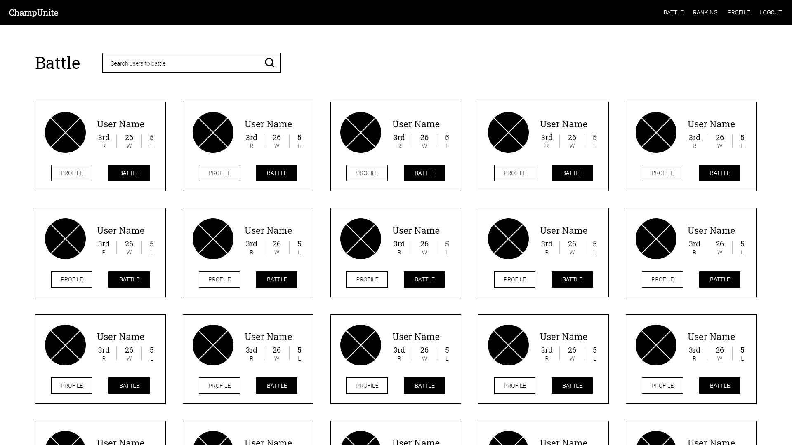
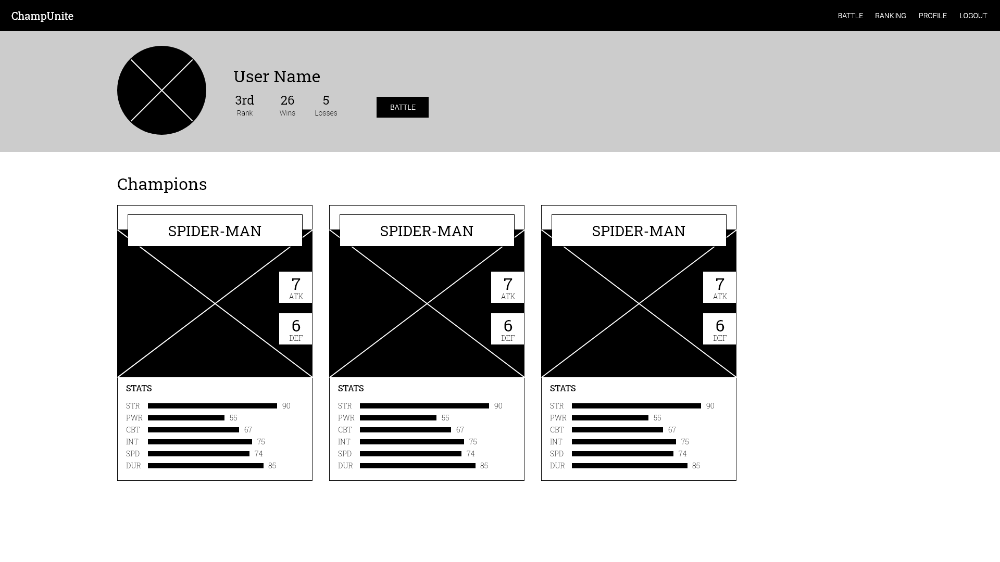
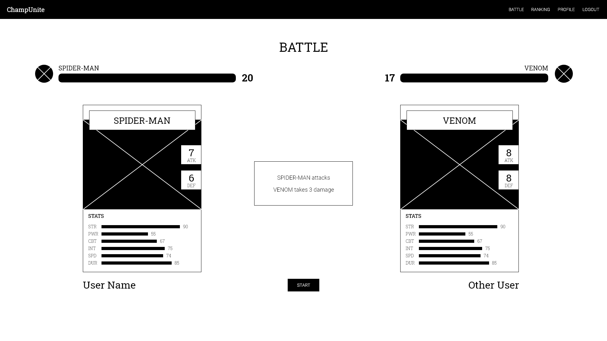

# ChampUnite
> A game application where users create a champion(s) to battle against other users on a one-on-one match.

This was a revamp of my first group project where I turned it into a full-stack app using the MERN stack. ChampUnite is for everyone who enjoys superheroes and card games. I used the [Superhero API](https://superheroapi.com/index.html) to get the superheroes' powerstats and calculated their Attack and Defense based off of those to be used during a one-on-one battle against other users. Users can also easily create their own champions or superheroes if they are unable to find them in the search or they just wanted better powerstats.


## User Stories

```
AS A supehero and game fanatic 
I WANT to search for or create my own champions
SO THAT I can put my favorite champions/superheroes on a one-one-battle and see who wins
```


## Acceptance Criteria

```
GIVEN the application
WHEN I arrive on the home screen
THEN I am presented with information and features of the app along with links for signing up and logging in
WHEN I click on the sign up button
THEN I am taken to the signup page where I can fill up a form to create an account
WHEN I click on the log in button
THEN I am taken to the login page where I can enter my credentials which will then take me to my profile page
WHEN I am on my profile page
THEN I can view my information including stats for my rank, wins, and losses and I can also see a section for my champions
WHEN I click on create button
THEN I am taken to a form where it asks for a name and an image url
WHEN I click the create button on the form page
THEN I am taken back to my profile and I can now see my new champion
WHEN I click on red x button on the card
THEN I don't see that champion anymore
WHEN I click on the Search button
THEN I am taken to the champions search page and I can see all the champions that have been searched
WHEN I type a query into the search field and submit
THEN the page reloads and I can now see what I have searched for
WHEN I click on the add button on the card
THEN I see an alert that I've just added a champion to my list
WHEN I click on Profile to get back to my profile page
THEN I can now see the champion that I just added
WHEN I click on the Users link on the navbar
THEN I am taken to the users search page and I can see all of the users except me
WHEN I click on the profile button
THEN I am taken to the user's profile page and I can see the user's information and list of champions
WHEN I click on the battle button
THEN I am asked to choose one of my champions
WHEN I click on the battle button on this modal after I've chosen my chamion
THEN I am taken to a battle page where I see my champion and the other user's champion with healthbars above each one
WHEN I click the start button
THEN I see a coundown from 3 and the battle starts with each champion taking turns and I can see the damage appearing over the card
WHEN one of the healthbars reaches zero
THEN I see a text saying either "You won!" or "You lost" and a leave button
WHEN I click on the leave button
THEN I am taken back to the users search page
WHEN I click on the Ranking link in the navbar
THEN I am taken to the ranking page with a table of users who have battle at least 20 times
```

## Deployed Application
[ChampUnite](https://champ-unite-v01.herokuapp.com/)

## Wireframes
   
  
  





  
